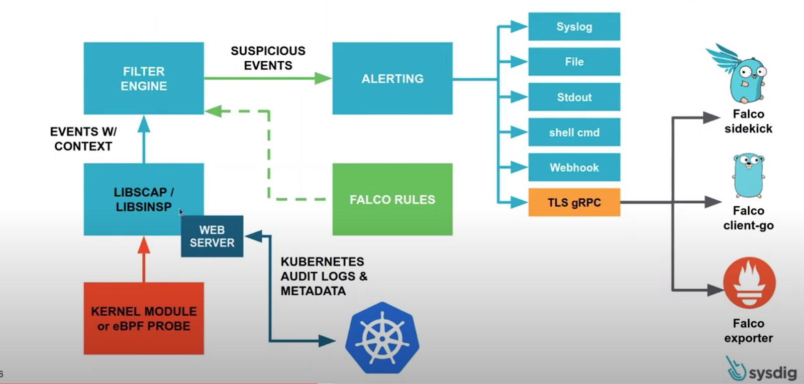

# Analyze Kubernetes Audit logs using Falco
There is concept called "Event Sources" in Falco, these "Event Sources" defines where Falco can consume events, and apply rules to these events to detect abnormal behavior. Currently Falco supports thefollowing event sources:

* System Calls (syscall) via the [drivers](https://falco.org/docs/event-sources/drivers)
* [Kubernetes Audit Events](https://falco.org/docs/event-sources/kubernetes-audit) (k8s_audit)

In this guide, we are going to use "Kubernetes Audit Logs" as an event source that Falco can consume.

<!-- START doctoc generated TOC please keep comment here to allow auto update -->
<!-- DON'T EDIT THIS SECTION, INSTEAD RE-RUN doctoc TO UPDATE -->

- 🧰 [Prerequisites](#prerequisites)

- 🎁 [What is in it for you ?](#what-is-in-it-for-you-)

-  [What are the meanings of Audit Log in Kubernetes ?](#what-are-the-meanings-of-audit-log-in-kubernetes-)
-  [How can you enable Audit Log feature in Kubernetes ?](#how-can-you-enable-audit-log-feature-in-kubernetes-)
-  [How can you enable embedded web server available within the Falco project ?](#how-can-you-enable-embedded-web-server-available-within-the-falco-project-)
-  [What is the purpose of Falcosidekick project ?](#what-is-the-purpose-of-falcosidekick-project-)

- 👨‍💻 [Hands On](#hands-on)

<!-- END doctoc generated TOC please keep comment here to allow auto update -->

# Prerequisites
*  Kubernetes Cluster v1.20.2 
*  tmux-cssh (or another tool to connect multiple SSH servers)
*  kubectl v1.20.2
*  Helm v3.5.1

# What is in it for you ?
You are going to learn: 
  * the meaning of audit logs in Kubernetes.
  * how you can enable Audit log feature in Kubernetes.
  * how you can enable embedded web server available within the Falco project.
  * the purpose of the Falcosidekick project.

# What are the meanings of Audit Log in Kubernetes ?
Kubernetes auditing provides a security-relevant, chronological set of records documenting the sequence of actions in a cluster. The cluster audits the activities generated by users, by applications that use the Kubernetes API, and by the control plane itself.

Auditing allows cluster administrators to answer the following questions:

* what happened?
* when did it happen?
* who initiated it?
* on what did it happen?
* where was it observed?
* from where was it initiated?
* to where was it going?

Audit records begin their lifecycle inside the kube-apiserver component. Each request on each stage of its execution generates an audit event, which is then pre-processed according to a certain policyand written to a backend. The policy determines what's recorded and the backends persist the records. The current backend implementations include logs files and webhooks.

> Credit: https://kubernetes.io/docs/tasks/debug-application-cluster/audit

# How can you enable Audit Log feature in Kubernetes ?
In this demo, we are going to use Webhook backend mode for Audit Log to be able to send audit logs to the webserver that is available within the Falco project.

The webhook audit backend sends audit events to a remote web API, which is assumed to be a form of the Kubernetes API, including means of authentication. You can configure a webhook audit backend using the following kube-apiserver flags:

* --audit-webhook-config-file specifies the path to a file with a webhook configuration. The webhook configuration is effectively a specialized kubeconfig.
* --audit-webhook-initial-backoff specifies the amount of time to wait after the first failed request before retrying. Subsequent requests are retried with exponential backoff.
The webhook config file uses the kubeconfig format to specify the remote address of the service and credentials used to connect to it.

> Credit: https://kubernetes.io/docs/tasks/debug-application-cluster/audit/#webhook-backend

# How can you enable embedded web server available within the Falco project ?
In this demo, we are going to using Helm to install the Falco, so, there is value that we can enableor disable to audit log feature called "auditLog.enabled", if we enable this, the embedded webserveris going to start within the Falco to consume audit events at port *8765* and behind the *k8s-audit* endpoint.

# What is the purpose of Falcosidekick project ?
By default, Falco has 5 outputs for its events: stdout, file, gRPC, shell and http.Even if they're convenient, we can quickly be limited to integrating Falco with other components. Here comes falcosidekick, a little daemon that extends that number of possible outputs.

The current list of available falcosidekick outputs (version 2.13.0) is:

* Slack
* Rocketchat
* Mattermost
* Teams
* Datadog
* AlertManager
* Elasticsearch
* Loki
* NATS
* Influxdb
* AWS Lambda
* AWS SQS
* SMTP (email)
* Opsgenie
* Webhook

Beyond that, it provides metrics about the number of events and let you add custom fields in events, for example environment, region, etc

# Hands On
