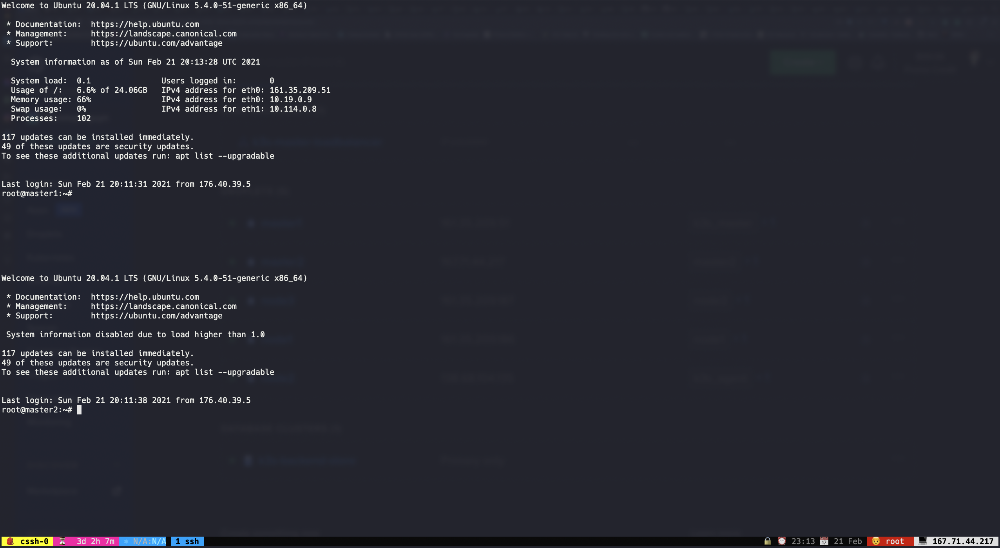
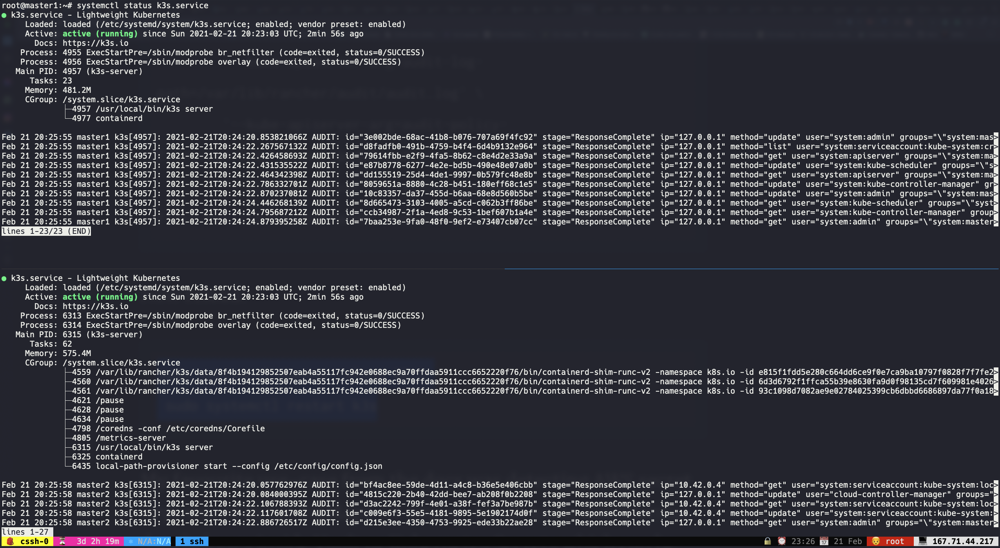
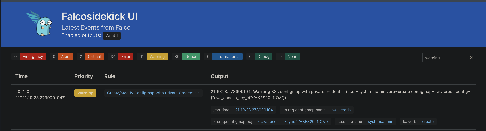

# Analyze Kubernetes Audit logs using Falco
There is concept called "Event Sources" in Falco, these "Event Sources" defines where Falco can consume events, and apply rules to these events to detect abnormal behavior. Currently Falco supports thefollowing event sources:

* System Calls (syscall) via the [drivers](https://falco.org/docs/event-sources/drivers)
* [Kubernetes Audit Events](https://falco.org/docs/event-sources/kubernetes-audit) (k8s_audit)

In this guide, we are going to use "Kubernetes Audit Logs" as an event source that Falco can consume.

<!-- START doctoc generated TOC please keep comment here to allow auto update -->
<!-- DON'T EDIT THIS SECTION, INSTEAD RE-RUN doctoc TO UPDATE -->

# Table of Contents
- 🧰 [Prerequisites](#prerequisites)

- 🎁 [What is in it for you ?](#what-is-in-it-for-you-)

-  [What are the meanings of Audit Log in Kubernetes ?](#what-are-the-meanings-of-audit-log-in-kubernetes-)
-  [How can you enable Audit Log feature in Kubernetes ?](#how-can-you-enable-audit-log-feature-in-kubernetes-)
-  [How can you enable embedded web server available within the Falco project ?](#how-can-you-enable-embedded-web-server-available-within-the-falco-project-)
-  [What is the purpose of Falcosidekick project ?](#what-is-the-purpose-of-falcosidekick-project-)

- 👨‍💻 [Hands On](#hands-on)
- 👀 [References](#references)

<!-- END doctoc generated TOC please keep comment here to allow auto update -->

# Prerequisites
*  Kubernetes Cluster v1.20.2 
*  tmux-cssh (or another tool to connect multiple SSH servers)
*  kubectl v1.20.2
*  Helm v3.5.1

# What is in it for you ?
You are going to learn: 
  * the meaning of audit logs in Kubernetes.
  * how you can enable Audit log feature in Kubernetes.
  * how you can enable embedded web server available within the Falco project.
  * the purpose of the Falcosidekick project.

# What are the meanings of Audit Log in Kubernetes ?
Kubernetes auditing provides a security-relevant, chronological set of records documenting the sequence of actions in a cluster. The cluster audits the activities generated by users, by applications that use the Kubernetes API, and by the control plane itself.

Auditing allows cluster administrators to answer the following questions:

* what happened?
* when did it happen?
* who initiated it?
* on what did it happen?
* where was it observed?
* from where was it initiated?
* to where was it going?

Audit records begin their lifecycle inside the kube-apiserver component. Each request on each stage of its execution generates an audit event, which is then pre-processed according to a certain policyand written to a backend. The policy determines what's recorded and the backends persist the records. The current backend implementations include logs files and webhooks.

> Credit: https://kubernetes.io/docs/tasks/debug-application-cluster/audit

# How can you enable Audit Log feature in Kubernetes ?
In this demo, we are going to use Webhook backend mode for Audit Log to be able to send audit logs to the webserver that is available within the Falco project.

The webhook audit backend sends audit events to a remote web API, which is assumed to be a form of the Kubernetes API, including means of authentication. You can configure a webhook audit backend using the following kube-apiserver flags:

* --audit-webhook-config-file specifies the path to a file with a webhook configuration. The webhook configuration is effectively a specialized kubeconfig.
* --audit-webhook-initial-backoff specifies the amount of time to wait after the first failed request before retrying. Subsequent requests are retried with exponential backoff.
The webhook config file uses the kubeconfig format to specify the remote address of the service and credentials used to connect to it.

> Credit: https://kubernetes.io/docs/tasks/debug-application-cluster/audit/#webhook-backend

# How can you enable embedded web server available within the Falco project ?
In this demo, we are going to using Helm to install the Falco, so, there is value that we can enableor disable to audit log feature called "auditLog.enabled", if we enable this, the embedded webserveris going to start within the Falco to consume audit events at port *8765* and behind the *k8s-audit* endpoint.

# What is the purpose of Falcosidekick project ?
By default, Falco has 5 outputs for its events: stdout, file, gRPC, shell and http.Even if they're convenient, we can quickly be limited to integrating Falco with other components. Here comes falcosidekick, a little daemon that extends that number of possible outputs.

The current list of available falcosidekick outputs (version 2.13.0) is:

* Slack
* Rocketchat
* Mattermost
* Teams
* Datadog
* AlertManager
* Elasticsearch
* Loki
* NATS
* Influxdb
* AWS Lambda
* AWS SQS
* SMTP (email)
* Opsgenie
* Webhook

Beyond that, it provides metrics about the number of events and let you add custom fields in events, for example environment, region, etc

# Hands On
In this demo, we are going provision our k3s cluster using Terraform and Ansible with HA support. To get more detail about the installation of the k3s cluster please follow the [link.](https://github.com/developer-guy/kubernetes-cluster-setup-using-terraform-and-k3s-on-digitalocean)
First, we are going to install Falco and the Falcosidekick with UI enabled. In order to do that, we'll use the Helm.
```bash
$ helm install falco --namespace falco --set falco.jsonOutput=true --set falco.httpOutput.enabled=true --set falco.httpOutput.url=http://falcosidekick:2801 --set falcosidekick.enabled=true --set falcosidekick.webui.enabled=true  falcosecurity/falco --set auditLog.enabled=true --create-namespace
NAME: falco
LAST DEPLOYED: Sun Feb 21 23:53:05 2021
NAMESPACE: falco
STATUS: deployed
REVISION: 1
NOTES:
Falco agents are spinning up on each node in your cluster. After a few
seconds, they are going to start monitoring your containers looking for
security issues.


No further action should be required.
```
Lets verify the installation.
```bash
$ kubectl --namespace=falco get pods
Found existing alias for "kubectl". You should use: "k"
NAME                                      READY   STATUS    RESTARTS   AGE
falco-falcosidekick-ui-5d59c77944-7htbc   1/1     Running   0          44s
falco-ckgqp                               1/1     Running   0          45s
falco-falcosidekick-6c5df8d54-6rb5h       1/1     Running   0          44s
falco-74vkg                               1/1     Running   0          45s
falco-falcosidekick-6c5df8d54-7tprb       1/1     Running   0          44s
falco-tc78l                               1/1     Running   0          45s
falco-48vk2                               1/1     Running   0          45s
falco-blkzl                               1/1     Running   0          45s
```

Then, we should expose embedded webserver to be able send logs to it from the master nodes.
```bash
$ kubectl patch svc falco --namespace=falco --type='json' -p '[{"op":"replace","path":"/spec/type","value":"NodePort"}]'
Found existing alias for "kubectl". You should use: "k"
service/falco patched
```

Get the NodePort ip of the Falco service to reach embedded server.
```bash
$  kubectl --namespace=falco get services                                                                                Found existing alias for "kubectl". You should use: "k"
NAME                     TYPE        CLUSTER-IP      EXTERNAL-IP   PORT(S)          AGE
falco-falcosidekick-ui   ClusterIP   10.43.221.136   <none>        2802/TCP         2m52s
falco-falcosidekick      ClusterIP   10.43.179.95    <none>        2801/TCP         2m52s
falco                    NodePort    10.43.114.83    <none>        8765:30958/TCP   2m52s 
```

After you set up the k3s cluster, lets enable Audit Log feature on the k3s master nodes. In order to do that, we'll use tmux-cssh to connect to the VMs. Copy your VM'S IP addresses first then run the following command:
```bash
$ tmux-cssh -o '-i ~/.ssh/digitalocean_rsa' root@161.35.209.51 root@167.71.44.217  # <-- This command will open a new tmux session and divide panes for each of the VM and syncronize commnds between them.
```

After you run the command you should see similar screen below:



After that, you should run the following commands to enable Audit Log, once you type command in one screen, it will appear in the other pane immediately.
```bash
$ sudo mkdir -p /var/lib/rancher/audit
$ wget https://raw.githubusercontent.com/falcosecurity/evolution/master/examples/k8s_audit_config/audit-policy.yaml
$ sudo cp audit-policy.yaml /var/lib/rancher/audit/
$ export IP=161.35.217.182
$ cat << EOF | sudo tee /var/lib/rancher/audit/webhook-config.yaml
apiVersion: v1
kind: Config
clusters:
- name: falco
  cluster:
    server: http://$IP:30958/k8s-audit
contexts:
- context:
    cluster: falco
    user: ""
  name: default-context
current-context: default-context
preferences: {}
users: []
EOF
```
Once you prepare the the files, we should edit our k3s.service in the VMs.
```bash
$ vim /etc/systemd/system/k3s.service
# add these lines to after the k3s server command.
# --kube-apiserver-arg=audit-log-path=/var/lib/rancher/audit/audit.log
# --kube-apiserver-arg=audit-policy-file=/var/lib/rancher/audit/audit-policy.yaml
# --kube-apiserver-arg=audit-webhook-config-file=/var/lib/rancher/audit/webhook-config.yaml
```

This Unit file should looks like the following above:
```Unit
[Unit]
Description=Lightweight Kubernetes
Documentation=https://k3s.io
Wants=network-online.target
After=network-online.target

[Service]
Type=notify
ExecStartPre=-/sbin/modprobe br_netfilter
ExecStartPre=-/sbin/modprobe overlay
ExecStart=/usr/local/bin/k3s server --kube-apiserver-arg=audit-log-path=/var/lib/rancher/audit/audit.log --kube-apiserver-arg=audit-policy-file=/var/lib/rancher/audit/audit-policy.yaml --kube-apiserver-arg=audit-webhook-config-file=/var/lib/rancher/audit/webhook-config.yaml --config /etc/rancher/k3s/config.yaml
KillMode=process
Delegate=yes
LimitNOFILE=1048576
LimitNPROC=infinity
LimitCORE=infinity
TasksMax=infinity
TimeoutStartSec=0
Restart=always
RestartSec=5s

[Install]
WantedBy=multi-user.target
```

After you edit the Unit file, you should reload the daemon and the k3s service.
```bash
$ sudo systemctl daemon-reload && \
 sudo systemctl restart k3s
```

If everything goes fine, you should see similar output like the following image below:



In order to test this scenario, we need to create an event that Falco provides alert for it.
```bash
$ kubectl create configmap aws-creds \
  --from-literal aws_access_key_id=AKES20LNOA
```

Once you created this, we should see the alert at the Falcosidekick UI.
```bash
$ kubectl --namespace=falco port-forward svc/falco-falcosidekick-ui 2802
Found existing alias for "kubectl". You should use: "k"
Forwarding from 127.0.0.1:2802 -> 2802
Forwarding from [::1]:2802 -> 2802
```

Open the browser, go to the localhost:2802, you should see similar screen following below:


# References
* https://blog.alexellis.io/falco-at-the-edge-arm64/
* https://falco.org/blog/extend-falco-outputs-with-falcosidekick/
* https://sysdig.com/blog/kubernetes-audit-log-falco

